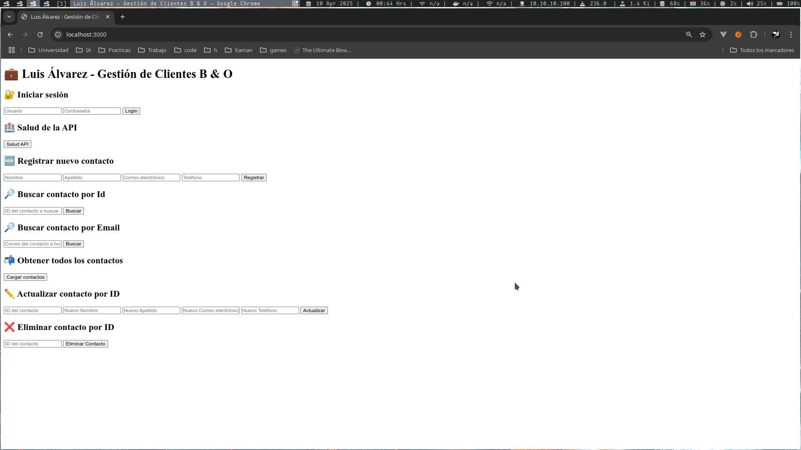

# 📬 API de Gestión de Contactos con HubSpot API (JWT + Node.js + Express)

Este proyecto implementa una API RESTful para gestionar contactos a través de la API de HubSpot.  
Incluye autenticación con JSON Web Tokens (JWT), validación y sanitización de datos, y pruebas automatizadas con Jest + Supertest.



---

## 🚀 Características principales

- CRUD completo de contactos (`GET`, `POST`, `PUT`, `DELETE`)
- Login con JWT (`/auth/login`)
- Middleware de autenticación personalizado con `jsonwebtoken`
- Validación de inputs con `express-validator`
- Peticiones HTTP a HubSpot usando `axios`
- Test unitarios con `jest` y `supertest`
- Cliente HTML para interactuar con la API desde el navegador (opcional)

---

## 🧰 Tecnologías utilizadas

- Node.js
- Express.js
- NPM (`Node Package Manager`)
- JWT (`jsonwebtoken`)
- Axios
- Express Validator
- Jest + Supertest (para testing)
- Dotenv
- Helmet + CORS (seguridad)

---

## ⚙️ Requisitos previos

- Node.js v18 o superior
- Cuenta en HubSpot con una API Key 

---

## 📦 Instalación

```bash
git clone https://github.com/crahantan/gestion-de-clientes-b-o.git
cd gestion-de-clientes-b-o
npm install
```

📄 Archivo .env
Crea un archivo .env en la raíz del proyecto con el siguiente contenido:
```env
PORT=3000
HUBSPOT_API_KEY=tu_token_de_hubspot
HUBSPOT_API_BASE=https://api.hubapi.com
DOMINIO=localhost
JWT_SECRET=supersecretoseguro
```

▶️ Construcción del secreto JWT
- Dirigite al directorio /src/utils
- Identifica el fichero jwtSecret.js
- Ejecuta el siguiente comando
```bash
node jwtSecret.js
```
- Te lanzará secreto que colocarás en el archivo .env
```bash
Tu JWT Generado es:  supersecretoseguro
```

---

## 🚀 Levantar Servidor

▶️ Levantar servidor localmente
```bash
npm start
```

▶️ Levantar servidor localmente en modo desarrollo
- Al levantar el servidor en modo de desarrollo podras utlizar nodemon, funcionalidad que mantiene al servidor activo cuando realizas modificaciones al código, evitando así, levantarlo cada vez que se realiza un cambio (Hot Reloading)
```bash
npm run dev
```

---

## ⚡Frontend

- Abre tu navegador y dirígete a: `http://localhost:3000`
- Observarás la siguiente interfaz para interactuar con ella:


---

## 🧪 Ejecutar pruebas unitarias

▶️ Para ejecuar pruebas unitarias utilizando Jest, ejecuta el siguiente comando:
```bash
npm test
```


